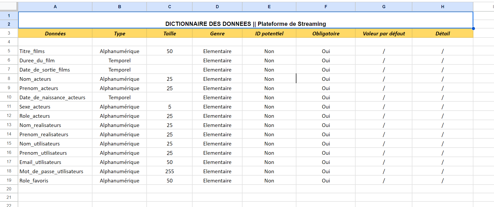
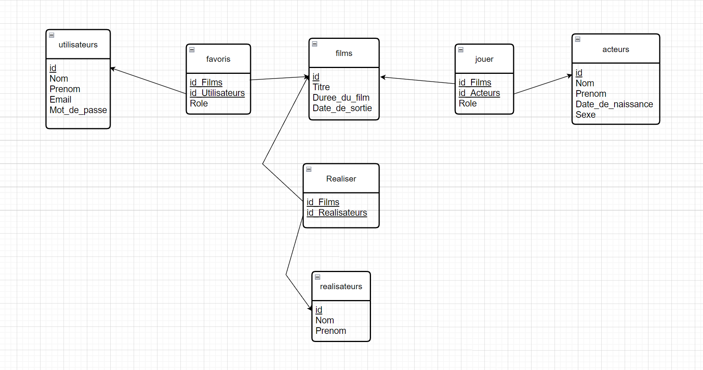
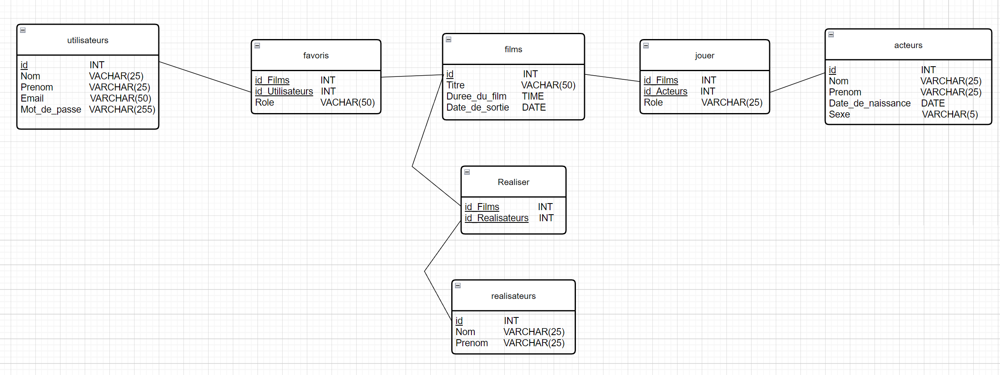

# Exercice Plateforme de Streaming

## Ennoncée

[Plateforme De Streaming](./Documents/Plateforme_De_Streaming.pdf)

## Le Dictionnaire de données 

## MCD (Modèle Conceptuel de Données)

Nous partons du principe que dans l'application, il est possible d'ajouter autant d'acteurs, de films, d'utilisateurs et de réalisateurs que l'on veut afin de les répertorier et avoir la possibilité de les liées entre eux afin de récupérer certaines informations.
Par rapport au contexte, on peut aussi observer que j'ai rajouté le sexe pour les acteurs. En effet, il est important de différencier cette donnée pour des recherches plus précise s'ils l'ont recherché un acteur ou une actrice.

## MLD (Modèle Logique de Données)

## MPD (Modèle Physique de Données)

## Création de la base de données

[Création de la base de données](./Documents/create_database.md)

## Création des tables

[Création des tables](./Documents/create_tables.md)

## Insertion des données

[Insertion des données](./Documents/insert_data.md)

## Requête

[Requête SQL](./Documents/requête.md)
