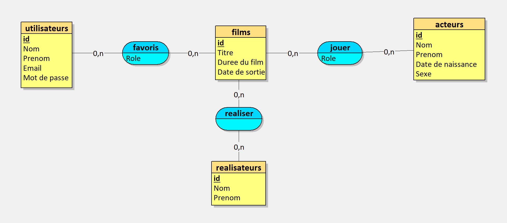

# Exercice Plateforme de Streaming

## Ennoncée

[Plateforme De Streaming](./Documents/Plateforme_De_Streaming.pdf)

## Le Dictionnaire de données 

## MCD (Modèle Conceptuel de Données)

## MLD (Modèle Logique de Données)

## MPD (Modèle Physique de Données)

## Création de la base de données

[Création de la base de données](./Documents/create_database.md)

## Création des tables

[Création des tables](./Documents/create_tables.md)

## Insertion des données

[Insertion des données](./Documents/insert_data.md)

## Requête

[Requête SQL](./Documents/requête.md)
